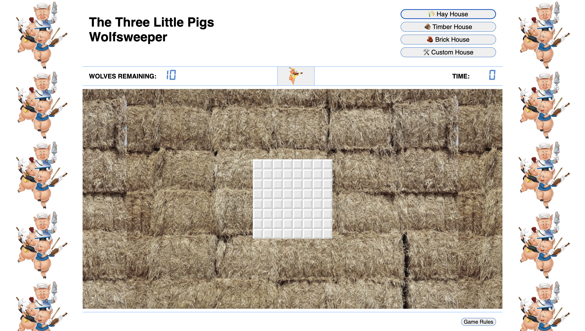
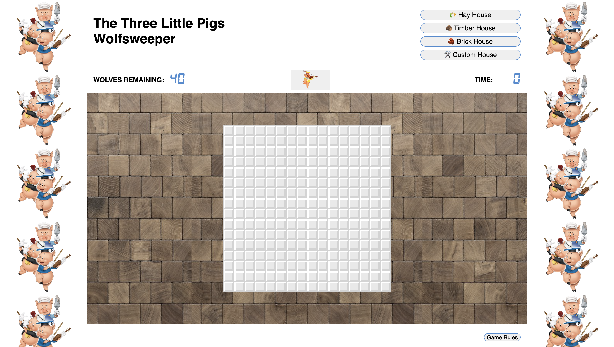
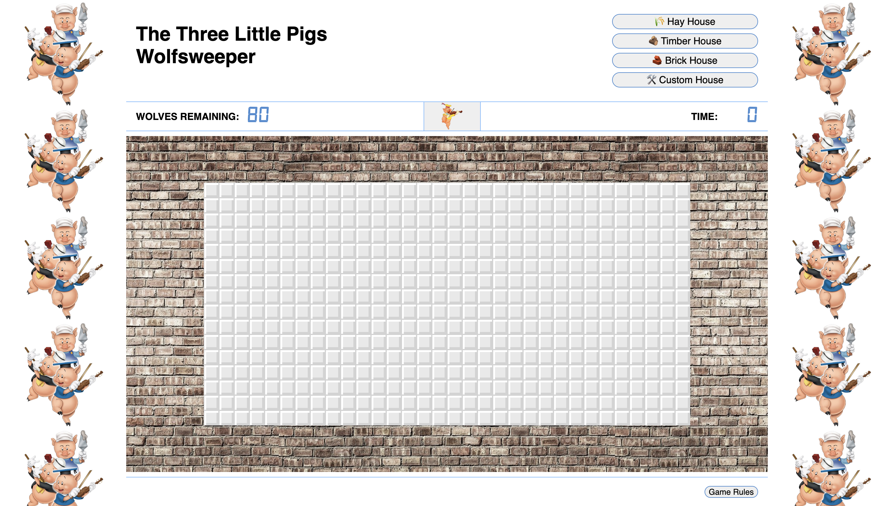

# Project 1 - Minesweeper


## Description
The Three Little Pigs - Wolfsweeper is a game based on Minesweeper, the classic Windows PC game. The set-up follows the folk tale of the Three Little Pigs.
Each level of the game represents a house, build of a specific material as per the story. 
The Big Bad Wolf has help from his pack, and they are trying to get into your house. In order to keep them away, you have to lock them all out.

## Game’s Link
https://annel18.github.io/GA-SEI-P1-Minesweeper/


## Timeframe & Working Team (Solo/Pair/Group)
This first project was a solo project
I had one week to build a grid-base game using JavaScript, HTML and CSS

## Technologies Used

HTML
- Calling links to the special fonts related to the stylesheet;
- Setting up the basic layout and DOM structure that JS will be able to query;
- Text for the title, level buttons and rules button;
- Text for the pop-up elements that will appear when required, when clicking on the rules button, or at the end of the game whether won or lost.

CSS
- Grid container is using Flexbox;
- Positioning each element adequately for the browser;
- The colour scheme for each number appearing in the grid has been set up through variables;
- Popup elements have a ‘position: absolute’ and therefore will cover the game with the desired instructions. A close button has been added to these pop-ups;
- Clickable elements (buttons and each cell of the grid) have been assigned a ‘cursor: pointer’ when the mouse hovers over them, the look of these also changes to inform the player which selection is currently active;
- @media queries have been added to remove sides and unnecessary elements when the screen is too narrow.
- Some of the selectors have the “:hover” extension that allows specific styling to be applied only when hovering the elements. 

JavaScript
- Left-click and Right-click events have been added to either open or lock a cell, the first click will initialise the game
‘setInterval’ to start the clock as soon as the game is started, this time will be the game’s score in seconds;
- The grid is built through JS depending on the chosen level;
- The position of the Wolves (mines) is random and redistributed each time the game is reset or the chosen level has changed;
- The grid has to recalculate the numbers appearing in each cell according to their adjacency to the wolves;
- The grid is updated accordingly when the chosen level changes or if the unfortunate faint made the player click on a wolf on the first click;
- A recursive algorithm has been implemented in order to open all surrounding cells if no wolf is present in any of them.
- Pop-up messages are displayed at the end of the game, whether win or lost. 
- If the player wins the game, the message will be tailored to show the score for the chosen level.
- A pop-up form will appear if the player has chosen to play on a customised level. The player has then the possibility to choose the variables that will dictate the custom set-up of the grid

## Brief
### Technical Requirements
- Render a game in the browser
- Be built on a grid: do not use HTML Canvas for this
- Design logic for winning & visually display which player won
- Include separate HTML / CSS / JavaScript files
- Stick with KISS (Keep It Simple Stupid) and DRY (Don't Repeat Yourself) principles
- Use Javascript for DOM manipulation
- Deploy your game online, where the rest of the world can access it (we will do this together at the end of the project)
- Use semantic markup for HTML and CSS (adhere to best practices)


## Planning
- I started by doing a wireframe sketch for the layout of the browser page
    
- Searched ideas for a theme that would fit well with the dynamic of the chosen game and collated on Pinterest images and icons that will be used later in the developed game
- I wrote a pseudocode that breaks down the various tasks, here is an extract:
    ```JS
    //? function to create the mines field
    // Radomly position the bombs - number of bombs depending on level  //*Add class of .bomb to these cells
    // each cell has to be assigned a number according to its proximity to the bombs
    // forEach - check if any of the 8 cells around have a bomb and increase bombCount by 1 when condition is true //*Add class .nbr to these cells
    // cells[i+1, i-1, i+widht, i+width+1, i+width-1, i-widht, i-width+1, i-width-1]
    // take care of special condition on the edges
    // all other cells remaining on 0 //*Add class of .safeZone
    // display either the bomb logo if element has .bomb class or display the number if the element has .nbr class
    ```
- Implemented the basic HTML and CSS to have to get started, and have an area on the page to host the grid that will be built through JS
- I used Trello as a project management tool to track my progress for this sprint and used labels to track completion 
    
    

## Build/Code Process

Day 1
- Implemented the basic HTML and CSS to have to get started, and have an area on the page to host the grid that will be built through JS and defining the zones as per the wireframe’s layout
- Created the various grid sized for each level in JS
    ```JS
    const levels = [
    { difficulty: 'BEGINNER', bombsNbr: 10, width: 8, height: 8 },
    { difficulty: 'INTERMEDIATE', bombsNbr: 40, width: 16, height: 16 },
    { difficulty: 'EXPERT', bombsNbr: 80, width: 32, height: 16 },
    { difficulty: 'CUSTOM', bombsNbr: 0, width: 0, height: 0 }
    ]
    ```
- Created a function to generate the mineField() 
    ```JS
    function mineField() {
    const bombsArray = []
    let hotSpots = []
    for (let i = 0; i < bombsNbr; i++) {
    while (hotSpots.length < bombsNbr) {
        const index = Math.floor(Math.random() * cellCount)
        bombsArray.push(index)
        // remove duplicates
        hotSpots = bombsArray.filter((value, index) => bombsArray.indexOf(value) === index)
        cells[index].classList.add('bomb')
    }}}
    ```

Day 2
- Adding the numbers around the wolves
- Working out the edges conditions. These conditions will have to be used many times throughout the code. I, therefore ultimately, implemented them within a class that returns the conditional arrays. This class will be called in each function needing it. This class has been named ‘SurroundingCells’, as it ultimately returns the surrounding cells indexes of a specific cell in question.
    ```JS
    class SurroundingCells {
        constructor(cell) {
            this.cell = cell
            this.NW = this.cell - width - 1
            this.N = this.cell - width
            this.NE = this.cell - width + 1
            this.E = this.cell + 1
            this.SE = this.cell + width + 1
            this.S = this.cell + width
            this.SW = this.cell + width - 1
            this.W = this.cell - 1
        }
        arrayOfSurroundingCells() {
            if (this.cell === 0) { //Top Left Corner
                return [this.E, this.S, this.SE]
            } else if (this.cell === width - 1) { //Top Right Corner
                return [this.S, this.W, this.SW]
            } else if (this.cell === cellCount - 1) { //Bottom Right Corner
                return [this.N, this.W, this.NW]
            } else if (this.cell === cellCount - width) { //Bottom Left Corner
                return [this.N, this.E, this.NE]
            } else if (this.cell < width) { //First Row
                return [this.E, this.S, this.W, this.SE, this.SW]
            } else if ((this.cell + 1) % width === 0) { //Last Column
                return [this.N, this.S, this.W, this.NW, this.SW]
            } else if (this.cell >= cellCount - width) { //Bottom Row
                return [this.N, this.E, this.W, this.NE, this.NW]
            } else if (this.cell % width === 0) { //First Column
                return [this.N, this.E, this.S, this.NE, this.SE]
            } else { // midfield
                return [this.N, this.E, this.S, this.W, this.NW, this.NE, this.SE, this.SW]
            }
        }
    }
    ```
- Implemented the reset button to be able to reset the game without having to refresh the game
- Implemented the clock that counts the seconds until the end of the game

Day 3
- Figure out the recursive loop to open all the empty cells (the class ‘SurroundingCells’ has proven to be very helpful to implement this recursive loop). This is the recursive function:

    ```JS
    function openEmptyBubbles(cellClicked) {
        const cellClickedIndex = cells.indexOf(cellClicked)
        let fieldInPlay = new SurroundingCells(cellClickedIndex)
        let arrayToCheck = fieldInPlay.arrayOfSurroundingCells()

        arrayToCheck.forEach(extendFieldToCheck)

        function extendFieldToCheck(query) {
            while (cells[query].classList.contains('safeZone')) {
                cells[query].classList.replace('safeZone', 'safeZoneClicked')
                cells[query].classList.remove('flag')
                cells[query].removeEventListener('contextmenu', addFlag)
                fieldInPlay = new SurroundingCells(query)
                arrayToCheck = fieldInPlay.arrayOfSurroundingCells()
                arrayToCheck.forEach(extendFieldToCheck)
            } if (cells[query].classList.contains('nbr')) {
                cells[query].classList.replace('nbr', 'nbrClicked')
                cells[query].removeEventListener('contextmenu', addFlag)
                cells[query].setAttribute('id', 'nbr' + cells[query].innerText)
            }
        }
    }
    ```
- Adding the flag function for when the player click right on a cell, and subsequently decreasing the wolf count
- If the flag is removed, the wolf could should increase increase again
- Disable left-click where the flag have been placed
- Re-enable left-click if flag removed

Day 4
- Update the colour of the cells according to the numbers they are holding
    - This has been implemented through CSS, using roots variables
        ```js
        :root {
        --nbrColor1: #7bbdff;
        --nbrColor2: #c7ff58;
        --nbrColor3: #f84f37;
        --nbrColor4: #ffb339;
        --nbrColor5: #c472ff;
        --nbrColor6: #76ffe6;
        --nbrColor7: #ff6ab7;
        --nbrColor8: #fcf934;
        }
        ```

- Working out the winning conditions - when all safe cells have been opened
    ```JS
    function winGame() {
        const allCells = document.querySelectorAll('.cell')
        const openCells = []
        allCells.forEach(function (cell) {
            if (cell.classList.contains('nbrClicked') || cell.classList.contains('flag') || cell.classList.contains('safeZoneClicked') || cell.classList.contains('bomb')) {
                openCells.push(cell)
                if (openCells.length === cellCount) {
                clearInterval(interval)
                difficultyDisplay.innerText = levelChoice.difficulty
                document.getElementById('win').classList.add('popupDisplay')
                }
            }
        })
    }
    ```
- Losing condition - when you click on a wolf - the clock stops and all the wolves are revealed

Day 5
- I spend this day updated the HTML and CSS to use the appropriate images and graphics suiting the theme
- Adjusted the size and colour of the cells to remain visible with the various background colours
- Add cursor: pointer to the buttons and clickable cells and added hover styles in CSS to make more visible to the user where they are about to click
- Added all the popup div in HTML and assigned a CSS style of display: none;
- Added further EventListener in JavaScript to reassign the style of these popups to be visible when specific buttons are clicked and when the game has ended.

Day 6
- Implementing the custom grid by asking the player to fill out a form and choose their own settings that will then be used in JavaScript to update the grid accordingly
    - This is the HTML form popup
        ```HTML
        <div class="popup" id="custom-form">
            <form action method="post" id="custom-difficulty">
            <div>
                <label for="width">Choose your custom width</label>
                <input type="number" name="width" class="custom-width" min="6" max="32" placeholder="6 < WIDTH > 32"
                required>
            </div>
            <div>
                <label for="height">Choose your custom height</label>
                <input type="number" name="height" class="custom-height" min="6" max="16" placeholder="6 < HEIGHT > 16"
                required>
            </div>
            <div>
                <label for="wolfs">Choose the numbers of wolfves</label>
                <input type="number" name="wolfs" class="custom-wolfs" min="2" max="80"
                placeholder="2 < WOLFVES > (width x height)" required>
            </div>
            <button class="close apply">Apply</button>
            </form>
        </div>
        ```
    - These are the functions that will build the customised grid and will update the parameters set for ```levels[3]``` defined above (see day1)
        ```JS
        function customGrid(evt) {
            resetVariables()
            evt.preventDefault()
            levels[3].width = parseInt(customWidth.value)
            levels[3].height = parseInt(customHeight.value)
            levels[3].bombsNbr = parseInt(customBombs.value)
            updateGrid(evt)
            popupClose()
        }
        function updateGrid(evt) {
            resetVariables()
            if (evt.target.classList.contains('easy')) {
            levelChoice = levels[0]
            } else if (evt.target.classList.contains('hard')) {
            levelChoice = levels[1]
            } else if (evt.target.classList.contains('expert')) {
            levelChoice = levels[2]
            } else if (evt.target.classList.contains('apply')) {
            levelChoice = levels[3]
            }

            width = levelChoice.width
            height = levelChoice.height
            cellCount = width * height
            bombsNbr = levelChoice.bombsNbr
            difficulty = levelChoice.difficulty
            createGrid()
        }   
    ```
## Game Snapshots
- Various levels give various grid sizes
    
    
    

- The Game Rules call for this popup to appear
    

- When the player clicks on an empty cell - all empty cells around are revealed
    

- When the player clicks on a wolf - this message appears, encouraging you to try again
    

- When you manage to WIN - this popup message appears telling you your score (time in seconds) for which level
    

- When you choose the custom level - this popup form asks you to enter your desired variables 
    

## Challenges
- Solving the recursive algorithm is what took me the longest, as expected. It was very satisfying when it ultimately worked and from that point onwards the game was playable.
- The first click cannot be a mine, otherwise, the game is immediately lost. Implementing this condition took me longer than expected
- Assigning the numbers according to their proximity to the wolves was also a challenge but not as much as the recursive algorithm. As for the latter, it has to query all 8 surrounding cells and then count how many of them are wolves
- Removing the eventListeners when appropriate to avoid opening a cell that has been flagged
- Implementing the custom options was also a challenge, the order in which the functions have to run is slightly different, as the player first has to fill in the form before the grid is regenerated.

## Wins
My biggest wins were the:
- Recursive algorithm to reveal all surrounding empty cells. This was a fundamental to the game, so it was a relief when the recursive loop worked and stopped crashing the browser;
- The customised grid. I really wanted to implement this bonus, so I was thrilled when I managed to ```parseInt``` the data from the popup form successfully. 
- The pop-up windows, made the interface of the game cleaner. I used these CSS classes and manipulated the DOM on the popup element to either add or remove the ```popupDisplay``` class
    ```css
    .popup {
    display: none;
    border-radius: 1em;
    background-color: white;
    border: 1px solid #478cd2;
    padding: 2em;
    position: absolute;
    align-items: center;
    width: 50%;
    }
    .popupDisplay {
    display: block;
    }
    ```

## Key Learnings/Takeaways
As this is my first Vanilla JavaScript project, everything constitutes key learning. But these are my takeaways:
- I learned a lot about addEventListeners and removeEventListeners and manipulated the DOM, but I'm also eager to learn about the React alternative.
- I learned how to use flex-box to create a grid, and I imagine that these are some of the main CSS functionalities to lay out a website. 
- It made me think a lot about the construction of the recursive algorithm without creating an infinite loop, as this was the main challenge of the game.


## Bugs
None that I’m aware of at this stage.

## Future Improvements
- Due to the nature of the game it is difficult to have it working on mobile phones, the size of the grids is constrained by the number of cells and therefore is likely to be over the mobile device sizes. That being said, there is probably a way to generate grids within those constraints. 
- Add sounds, not much though, minesweeper is not an arcade game and it doesn't rely on sound effects to enhance its experience, but it could be a nice addition.

